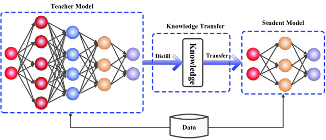
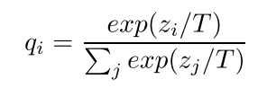

### 知识蒸馏 ###  

  

- 其主要目的是为了压缩模型的体积，以便其更加适应轻量级环境的部署，例如自动驾驶汽车的障碍物识别等等，若是大型模型则会无法进行高效地、快速地识别以反应周遭变化快速的环境。

## 文献综述 ##  
## 1.Model Compression ##  
Core:*模型压缩，即将体积较大、性能卓越的大集成学习模型（下称为“Teacher”）压缩为可在资源有限的设备上运行的小神经网络模型（下称为“Student”），且取得照样不错的结果，大幅缩小其体积、提高其速度*  
- Background:集成学习取得了成功，许多模型能够取得优秀的测试结果，如NB、随机森林等等，但唯一的缺点就是**体积大、速度慢、资源要求高**

具体步骤:  
Step1:为一个大规模的无标签训练集，使用Teacher进行预测，生成**伪标签**（一般是加权投票所产生的的权值）  
Step2：构建Student，针对生成的伪标签数据集进行学习。  
换言之，Student学习的并不是数据，而学习的是**Teacher在数据上学习到的函数**

## 2.Distilling the Knowledge in a Neural Network ##  
- Core:相较于Caruana的措施，本文在其基础上进行了创造性延申。  
- 首先Teacher由原本的集成模型，扩展范围将神经网络也包含在其中。Hinton认为**Knowledge本质上就是输入向量到输出向量的一种映射关系**，因此，不只是“正确信息”，“错误信息”也照样有学习的价值。
- 在这个认知之下，Student训练所需要的样本数就比Teacher训练的样本数要少得多，因为当Teacher给出Soft Target时，其相较于One-hot编码输出的hard Target所蕴含的信息就要多得多，故所需要的样本也少很多。同时引入了在Hinton文章中的核心创新点：**Temperature**

# Temperature #  
由于在概率极小的类别中依旧隐藏着大量的信息，而这些信息在经过Softmax之后很容易被忽略（如果输出向量实在过于尖锐，概率就实在是太低了，所蕴含的信息就很容易被小模型所忽略）。Caruana的做法是直接让Student学习每个分类类别的Logit，而Hinton则引入了“Temperature”这一超参数，并采用以下公式，对向量进行了“软化”：  
  
  

