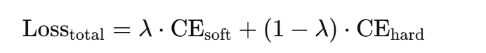

# 知识蒸馏 #  

    

- 其主要目的是为了压缩模型的体积，以便其更加适应轻量级环境的部署，例如自动驾驶汽车的障碍物识别等等，若是大型模型则会无法进行高效地、快速地识别以反应周遭变化快速的环境。

## 文献综述 ##  
## 1.Model Compression ##  
Core:*模型压缩，即将体积较大、性能卓越的大集成学习模型（下称为“Teacher”）压缩为可在资源有限的设备上运行的小神经网络模型（下称为“Student”），且取得照样不错的结果，大幅缩小其体积、提高其速度*  
- Background:集成学习取得了成功，许多模型能够取得优秀的测试结果，如NB、随机森林等等，但唯一的缺点就是**体积大、速度慢、资源要求高**

具体步骤:  
Step1:为一个大规模的无标签训练集，使用Teacher进行预测，生成**伪标签**（一般是加权投票所产生的的权值）  
Step2：构建Student，针对生成的伪标签数据集进行学习。  
换言之，Student学习的并不是数据，而学习的是**Teacher在数据上学习到的函数**

---

## 2.Distilling the Knowledge in a Neural Network ##  
- Core:相较于Caruana的措施，本文在其基础上进行了创造性延申。  
- 首先Teacher由原本的集成模型，扩展范围将神经网络也包含在其中。Hinton认为**Knowledge本质上就是输入向量到输出向量的一种映射关系**，因此，不只是“正确信息”，“错误信息”也照样有学习的价值。
- 在这个认知之下，Student训练所需要的样本数就比Teacher训练的样本数要少得多，因为当Teacher给出Soft Target时，其相较于One-hot编码输出的hard Target所蕴含的信息就要多得多，故所需要的样本也少很多。同时引入了在Hinton文章中的核心创新点：**Temperature**

### Temperature ###  
由于在概率极小的类别中依旧隐藏着大量的信息，而这些信息在经过Softmax之后很容易被忽略（如果输出向量实在过于尖锐，概率就实在是太低了，所蕴含的信息就很容易被小模型所忽略）。Caruana的做法是直接让Student学习每个分类类别的Logit，而Hinton则引入了“Temperature”这一超参数，并采用以下公式，对向量进行了“软化”：  

    

   
将每个类别的输出logit Zi除以一个T（T在1周围波动）后再进行Softmax归一化，则会使其更加接近（T>1），或更加远离（T<1）。从而起到“软化”或者“锐化”的效果，以避免信息的流失。  
在知识蒸馏中，我们使用高温 softmax（T>1）从教师模型中生成更平滑的soft targets，让学生模型可以学习到类间结构和细致判断。  
在此基础上，Hinton还提出了一个混合损失函数：由hard targets和soft targets的交叉熵损失进行权重组合，得到的新的混合损失函数，以soft targets为主，佐以hard targets的方向修正，会得到更好的训练结果。    

    

   
Tips：由于将Lsoft对温度T求偏导可得Lsoft较1/T2成正比，也就是随着温度的增大，Lsoft梯度下降很快，面临着梯度消失的危险。故可以在Lsoft前加上参数T2以平衡、稳定Lsoft与Lhard的权重。  

### MNIST实验设计 ###  
在Student网络共600个神经元，较Teacher网络减少了一般的参数量，温度T设置为20时，错误案例仅仅为74，较之Teacher网络仅仅多了7个错误样本，体积却减小了一半。  
并且当Student网络体积极度小（一共60个神经元）时，温度设置为T=2.5~4之间的错误率显著低于其他T温度值。可见若想取得最优体积优化效果，超参数T的调优必不可少。  

Hinton还做了一个有趣的实验：当数字“3”的所有样本都被从数据集中去除掉后，人为修改类别“3”的偏置到正常水准，可得Student模型的准确率仍旧为98.3%，可见模型由Soft targets分布中可以学习到巨量的信息。  

### 其他实验的测试验证 ###  
- 在语音识别领域，Hinton将一个10语音模型集成的大模型网络进行了蒸馏，在将原模型的体积压缩到1/10之后，准确率依然保持持平。
- 在超大型数据集（Google JFT：1亿个样本、15000个分类类别，单独模型训练了超6个月）上，或许大型模型进行蒸馏这条路行不通？但是我们另辟蹊径：先训练出一个Generlist进行大体的模糊识别，而后再在模糊识别的基础上进行协方差矩阵的计算，筛选出关联度高的一个个类别组合，在这些类别组合的基础上进行Specialist的训练，最后采取1个Generlist+多个Specialist的组合模型，可以得到与一个单独大模型相同的效果！在这之后再对一个个单独的Specialist模型进行蒸馏，缩小体积、提高速度，则可以大幅提升在超大型数据集上的模型训练效率。
- 在语音识别的Teacher模型架构上，使用Soft target进行训练，结果只用了原始数据集的3%数据量，就达到了与使用Hard target的100%数据量相同的准确率。

---

## 3.Knowledge Distillation: A Survey ##  

